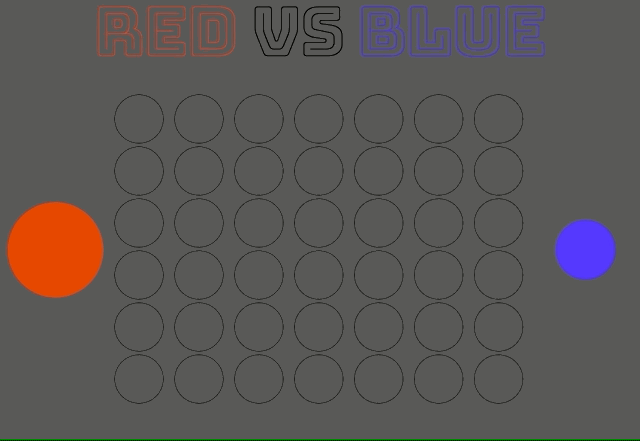

# Connect four

## Overview

A two player connection game. The player who first connect 4 stones horizontal or vertical wins the game.

<a href="https://spiced-connect-four.herokuapp.com/">PLAY NOW</a>

## Technologie

- JavaScript, jQuery, html5, CSS3, flexbox

## Features

- Board with six rows and seven columns
- Two players take turns selecting a column to drop their checker into
- When a player wins, a message appears to announce the victory
- After a player wins, it should be possible to reset the game and play again
- e gameplay should involve at least one animation (for example, the checkers could fall into their slot rather than just appear instantaneously)

## Bonus features

- After a player wins, visually indicate which four pieces on the board satisfied the victory condition

## Preview

**horizontal win**

**diagonal win**

